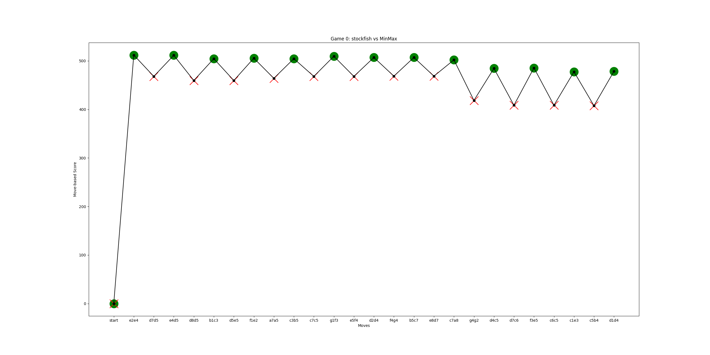
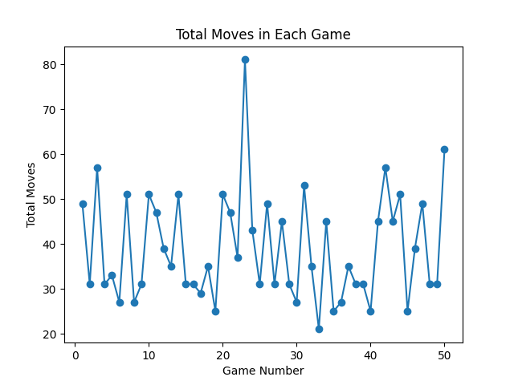

# Chess AI - Still Naive Bot

This project implements a simple chess AI using the Min-Max algorithm with evaluation functions. The game can be played in different modes, including human vs bot and bot vs bot.

## Prerequisites

Make sure you have Python installed on your system. Additionally, you'll need to install the following Python packages:

- [pygame](https://www.pygame.org/)
- [python-chess](https://python-chess.readthedocs.io/)
- [Stockfish](https://stockfishchess.org/)

## Installation

1. **Install Python:**

   Download and install Python from the official website: [Python Downloads](https://www.python.org/downloads/)

2. **Install pygame:**

   ```bash
   pip install pygame

3. **Install Python-Chess:**
   ```bash
   pip install python-chess
4. **Install StockFish:**
   ```bash
   https://stockfishchess.org/download/
   # we use windows OS and have installed the installed windows version of stockfish to use in Stockfish_FilePath.py

## How to Run
Human vs bot:
- initially navigate to HumanVSbot.py and uncomment the last two
lines of the code.
- if you are using it in IDE [pycharm], you can directly run the program and enjoy playing the game.
- if you want to run it through terminal
   ```bash
   python HumanVSbot.py

Stockfish vs bot:
- initially navigate to StockfishVSbot.py and uncomment the last two
lines of the code.
- also navigate to Stockfish_FilePath.py and update your stockfish excecutable file path.
- if you are using it in IDE [pycharm], you can directly run the program and enjoy watching the game between stockfish and MIN - MAX.
- if you want to run it through terminal
  ```bash
   python StockfishVSbot.py

## Result
Stockfish vs Bot game:
- Move based score evaluation for both stockfish [green .] and bot [red X]


  
      ```
         So as we see after certain point of the game we see a huge spike in 
         difference of score between players showing a bad move made by Min max bot.
       ```

- 50 concecute games later, graph of each game vs number of total moves per each game 
   ```bash
   max number of moves = 81
   minimum number of moves = 21
   Average number of moves over 50 games = 38.92 
   


## PPT explanation of project

- please checkout out ppt of the project at : https://tinyurl.com/535project

# conculsion
